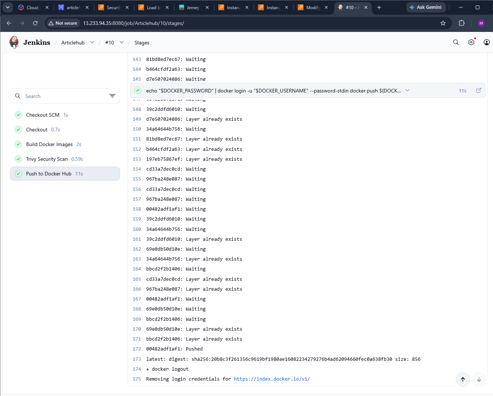

# ArticleHub – DevOps Deployment Project

## Overview

ArticleHub is a full-stack article and blog application deployed using a practical DevOps workflow on AWS.

The application contains:

* React + Vite frontend
* Node.js + Express backend
* PostgreSQL database
* Docker and Docker Compose
* Jenkins CI pipeline
* Trivy container image scanning
* Docker Hub
* Terraform
* Ansible
* AWS EC2
* AWS Application Load Balancer
* AWS RDS PostgreSQL

The project demonstrates how an application can be containerized, scanned, stored in a Docker registry, deployed on AWS, and made publicly accessible through an Application Load Balancer.

----

## Architecture

```text
                    GitHub
                       |
                       v
                    Jenkins
                       |
             +---------+---------+
             |         |         |
          Checkout   Docker    Trivy
                     Build      Scan
                       |
                       v
                  Docker Hub
                       |
                       v
                   AWS Cloud
                       |
              +--------+--------+
              |                 |
           Terraform          RDS
              |             PostgreSQL
              v
             EC2
              |
           Ansible
              |
        Docker Compose
          /       \
         /         \
   Frontend       Backend
    :3000          :5000
       |
       v
Application Load Balancer
        :80
```

---

# Technologies Used

| Technology          | Purpose                                       |
| ------------------- | --------------------------------------------- |
| GitHub              | Source code management                        |
| Jenkins             | Continuous Integration                        |
| Docker              | Application containerization                  |
| Docker Compose      | Running frontend and backend containers       |
| Trivy               | Container image security scanning             |
| Docker Hub          | Docker image registry                         |
| Terraform           | Infrastructure as Code                        |
| Ansible             | Server configuration and deployment           |
| AWS EC2             | Application hosting                           |
| AWS ALB             | Public application access and traffic routing |
| AWS Target Group    | Registers and health-checks the EC2 target    |
| AWS Security Groups | Network access control                        |
| AWS RDS             | Managed PostgreSQL database                   |
| React + Vite        | Frontend                                      |
| Node.js + Express   | Backend                                       |
| Nginx               | Production frontend server                    |

---

# Application Components

## Frontend

The frontend is built using React and Vite.

The production frontend is served using Nginx inside a Docker container.

```text
EC2 Port 3000 → Container Port 80
```

## Backend

The backend is built using Node.js and Express.

The backend runs on:

```text
Port 5000
```

## Database

The application uses PostgreSQL hosted on AWS RDS.

The configured database is:

```text
Database: my_db
Engine: PostgreSQL
Port: 5432
Instance class: db.t3.micro
Storage: 20 GB
Publicly accessible: No
```

The RDS database is protected using a separate security group. PostgreSQL access is allowed from the ArticleHub application server.

---

# Docker

The frontend and backend are containerized separately.

The containers are:

```text
articlehub-frontend
articlehub-backend
```

They communicate through the Docker network:

```text
articlehub-network
```

The frontend is exposed on port `3000` and the backend on port `5000`.

The containers were verified on the EC2 server using:

```bash
docker ps
```

The frontend was also verified locally using:

```bash
curl -I http://localhost:3000
```

The response returned:

```text
HTTP/1.1 200 OK
Server: nginx
```

### Docker Containers


### Docker Compose


---

# Jenkins CI Pipeline

Jenkins is used for the Continuous Integration workflow.

The Jenkins pipeline performs the following steps:

1. Checkout the ArticleHub source code from GitHub.
2. Build the backend Docker image.
3. Build the frontend Docker image.
4. Scan both Docker images using Trivy.
5. Push the Docker images to Docker Hub.

The Docker images are:

```text
meenakshisunil/articlehub-backend:latest
meenakshisunil/articlehub-frontend:latest
```

### Jenkins Pipeline Success



---

# Trivy Security Scan

Trivy is included in the Jenkins pipeline to scan the Docker images for known vulnerabilities.

The pipeline scans:

```text
meenakshisunil/articlehub-backend:latest
meenakshisunil/articlehub-frontend:latest
```

This provides a security check before the images are pushed to Docker Hub.

---

# Docker Hub

After the Docker images are built and scanned, Jenkins authenticates with Docker Hub and pushes the images.

Images:

```text
meenakshisunil/articlehub-backend:latest
meenakshisunil/articlehub-frontend:latest
```

---

# Terraform

Terraform is used as Infrastructure as Code to create and manage the AWS infrastructure required by ArticleHub.

The Terraform configuration contains:

```text
main.tf
variables.tf
alb.tf
rds.tf
```

The AWS region used is:

```text
ap-south-1
```

Terraform provisions the main infrastructure components including:

* EC2
* Security Groups
* Application Load Balancer
* Target Group
* Target Group Attachment
* ALB Listener
* RDS PostgreSQL

### Terraform Infrastructure


### Terraform Apply


---

# AWS EC2

The ArticleHub application is deployed on an AWS EC2 instance.

The EC2 instance runs:

* Docker
* Docker Compose
* ArticleHub frontend
* ArticleHub backend

The application deployment directory is:

```text
/opt/articlehub
```

### EC2 Instance


---

# Ansible

Ansible is used for server configuration and application deployment on the EC2 instance.

The Ansible workflow includes tasks such as:

1. Connecting to the EC2 server.
2. Preparing the server for Docker.
3. Creating the application deployment directory.
4. Getting the ArticleHub application.
5. Building the application containers.
6. Starting the application using Docker Compose.
7. Verifying the deployment.

The deployment is performed on:

```text
/opt/articlehub
```

### Ansible Playbook


### Ansible Successful Execution


---

# AWS Application Load Balancer

An Application Load Balancer provides public access to the ArticleHub application.

The ALB is configured with:

```text
Protocol: HTTP
Listener: Port 80
```

The ALB forwards incoming requests to the ArticleHub target group.

Traffic flow:

```text
User
 |
 v
Application Load Balancer :80
 |
 v
Target Group :3000
 |
 v
ArticleHub EC2
 |
 v
Frontend Container
```

### Application Load Balancer


### ALB Listener


---

# Target Group

The ArticleHub target group is configured as:

```text
Name: articlehub-tg
Target Type: Instance
Protocol: HTTP
Port: 3000
Health Check Path: /
```

The EC2 instance is registered as the target.

The target was successfully reported as:

```text
Healthy
```

### Target Group Health


---

# Security Groups

Two main security groups are used for the application infrastructure.

## ALB Security Group

The Application Load Balancer security group allows public HTTP traffic:

```text
Protocol: TCP
Port: 80
Source: 0.0.0.0/0
```

### ALB Security Group


## Application Security Group

The ArticleHub EC2 security group contains rules for:

```text
SSH       → 22
Frontend  → 3000
Backend   → 5000
```

The frontend and backend application ports are accessed from the ALB security group.

### Application Security Group


---

# AWS RDS PostgreSQL

The project uses Amazon RDS to host the PostgreSQL database.

The configured database includes:

```text
Identifier: articlehub-postgres
Engine: PostgreSQL
Database: my_db
Port: 5432
Instance class: db.t3.micro
Storage: 20 GB gp3
Publicly accessible: No
```

The database is placed behind an RDS security group.

The RDS security group allows PostgreSQL traffic from the ArticleHub application security group.

This keeps the database from being directly exposed to the public internet.

### RDS Database


---

# End-to-End Deployment Flow

The complete project flow is:

```text
Developer
    |
    v
GitHub
    |
    v
Jenkins
    |
    +---- Checkout
    |
    +---- Build Docker Images
    |
    +---- Trivy Security Scan
    |
    +---- Push Images to Docker Hub
    |
    v
Terraform
    |
    +---- EC2
    +---- Security Groups
    +---- Application Load Balancer
    +---- Target Group
    +---- RDS PostgreSQL
    |
    v
Ansible
    |
    +---- Configure EC2
    +---- Deploy ArticleHub
    +---- Start Docker Compose
    |
    v
Application Load Balancer
    |
    | HTTP :80
    v
Target Group
    |
    | HTTP :3000
    v
ArticleHub Frontend
    |
    v
ArticleHub Backend :5000
    |
    v
AWS RDS PostgreSQL :5432
```

---

# Deployment Verification

The deployment was verified at multiple levels.

### Docker Containers

Both frontend and backend containers were running successfully.


### Application

The ArticleHub application was successfully accessed through the Application Load Balancer.


### ALB HTTP Response

The ALB returned:

```text
HTTP/1.1 200 OK
```


### Target Health

The target group reported the EC2 instance as healthy.


---

# Project Screenshots

The following screenshots are included in this repository as evidence of the implemented infrastructure and deployment.

## 01 – ArticleHub Application


## 02 – EC2 Instance


## 03 – RDS Database


## 04 – Application Load Balancer


## 05 – ALB Listener


## 06 – Target Group Health


## 07 – ALB Security Group


## 08 – Application Security Group


## 09 – Docker Containers


## 10 – Docker Compose


## 11 – Ansible Playbook


## 12 – Ansible Success


## 13 – Jenkins Success


## 14 – Terraform Infrastructure


## 15 – Terraform Apply


## 16 – ALB HTTP 200


---

# What This Project Demonstrates

This project demonstrates practical experience with:

* Git and GitHub
* Jenkins CI
* Docker
* Docker Compose
* Trivy
* Docker Hub
* Ansible
* Terraform
* AWS EC2
* AWS Application Load Balancer
* AWS Target Groups
* AWS Security Groups
* AWS RDS PostgreSQL
* Containerized application deployment
* Infrastructure as Code
* Cloud-based application deployment

---

# Final Result

ArticleHub was successfully containerized and deployed on AWS.

The final workflow is:

```text
GitHub
   ↓
Jenkins
   ↓
Docker Build
   ↓
Trivy Scan
   ↓
Docker Hub
   ↓
Terraform AWS Infrastructure
   ↓
Ansible Deployment
   ↓
AWS EC2
   ↓
Application Load Balancer
   ↓
ArticleHub Application
   ↓
AWS RDS PostgreSQL
```

The application was successfully verified through the Application Load Balancer and returned an HTTP `200 OK` response.

---

## Author

**Meenakshi Sunil**

GitHub: https://github.com/minaxi1234
